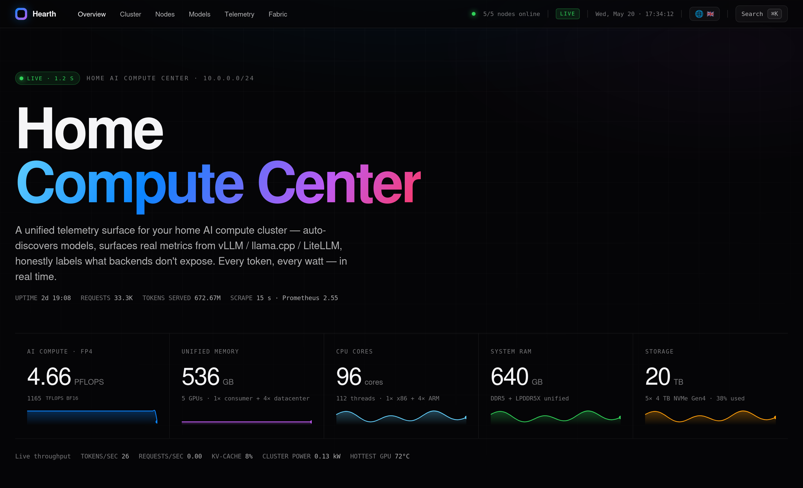
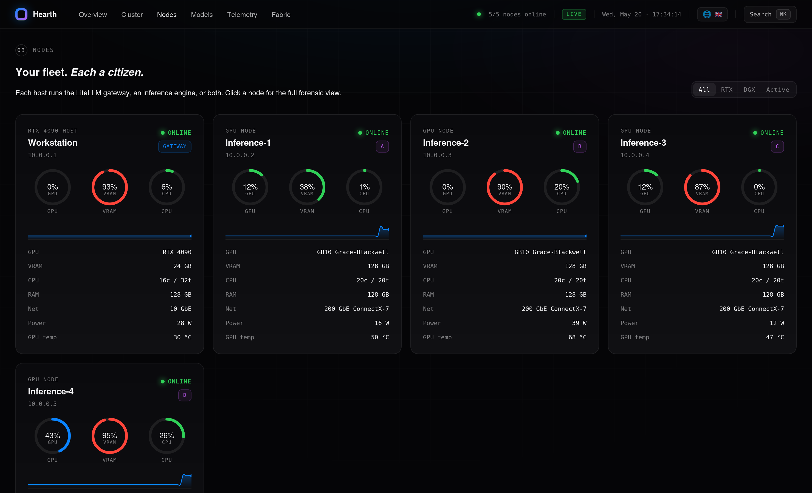
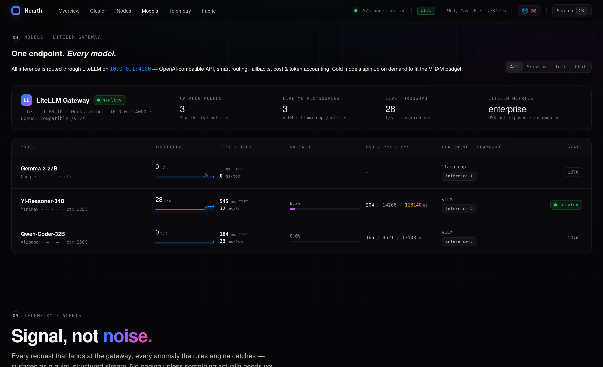
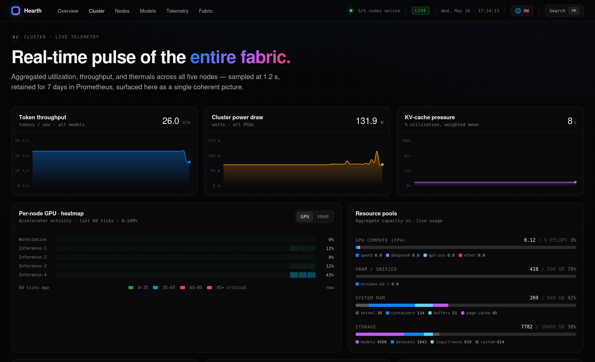
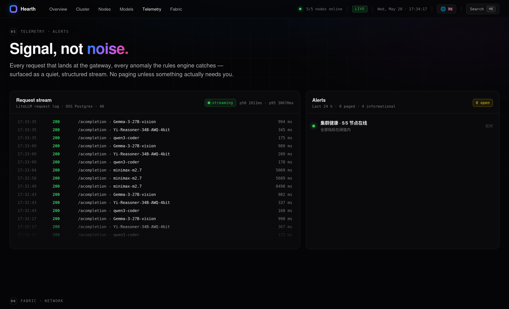
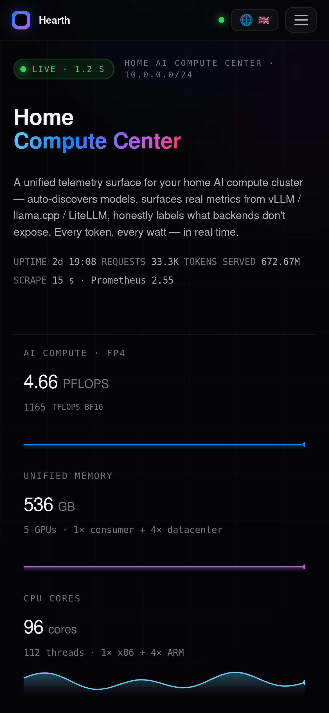
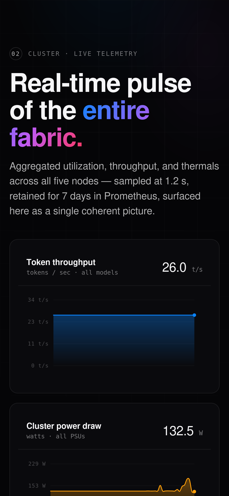
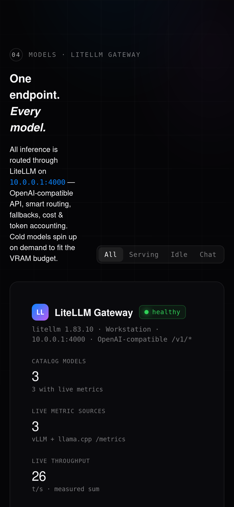

<div align="center">

# Hearth

**家庭 AI 算力叢集的單畫面監控儀表板。**

為在家裡跑 LLM 的人(一台機器或多台節點都可以)而做的自架可觀測性儀表板。
vLLM、llama.cpp、SGLang、Ollama、LiteLLM 閘道——**自動發現、真實指標、誠實標註**。

[](LICENSE)
[](#目前狀態)

[English](README.md) · [简体中文](README.zh-CN.md) · **繁體中文**

<br>



</div>

## 為什麼是 Hearth

大多數家庭實驗室監控**要嘛**通用(Grafana / Netdata 擅長主機指標但對 LLM 服務無感),**要嘛**專做 LLM 但雲端優先(Phoenix、LangSmith)。Hearth 處在交集上:**一個儀表板同時懂你的主機和你的模型**,為在自家 GPU 上跑 DeepSeek / Qwen / Gemma 的人而設計。

視覺語言刻意做成 **Apple Pro Display 控制台**風格:深黑底、等寬數字、環形儀表、細邊框。不是趕流行,而是「密度 + 克制」才是你每天瞄五十次的遙測資料應有的文法。

---

## 它是什麼

Hearth 在一個面板裡呈現:

- **節點狀態**——GPU / 顯記憶體 / CPU / 記憶體 / 溫度 / 功率,即時更新
- **模型狀態**——哪些在服務、吞吐(t/s)、TTFT、TPOT、KV-cache 佔用、p50/p95/p99,**自動從 LiteLLM 閘道 / vLLM / llama.cpp 的 `/metrics` 探得**
- **閘道流量**——近期請求、錯誤、延遲(**直接讀 LiteLLM 開源版自帶的 Postgres `SpendLogs`,不需要企業版**)
- **誠實標註空缺**——後端不暴露的指標(例如 llama.cpp 沒有 TTFT 直方圖),介面顯示 `—`,**絕不偽造數字**

**目標場景**:家庭算力叢集,1 到 ~10 節點,異構 GPU,可能跑多種推論框架,可能掛在 LiteLLM 閘道後。**單機也能跑**。

## 目前狀態

🏗️ **Alpha 階段——積極開發中。**

本專案最初是為一個 5 節點的家庭叢集而做的個人監控,正逐步通用化以適用一般家用算力場景。設定正從硬寫常數遷移到聲明式 YAML。詳見 [`CHANGELOG.md`](CHANGELOG.md) 與下方路線圖。

`v0.1.0-alpha` 已發佈 — 設定即資料落地, 用上游的 5 節點實際叢集按 YAML 設定端到端複測過, `/api/nodes`、`/api/models`、`/api/cluster` 與硬寫參考實作行為一致。歡迎試用; 邊緣拓樸可能還有粗糙處, 待 `v0.2.0` 轉接器層完善。

## 快速開始

> **前置條件**:跑 Hearth 的主機上要有 Docker + Docker Compose。可選:在每個 GPU 節點上裝 Prometheus + DCGM exporter(沒裝也能用,Hearth 會優雅降級)。

```bash
git clone https://github.com/tonyliu312/hearth.git
cd hearth/server
cp .env.example .env          # 編輯密鑰(LiteLLM master key 等)
docker compose up -d
open http://localhost:8080
```

多節點設定詳見 [`docs/topology.md`](docs/topology.md)(於 v0.1.0 / P1 提供)。

## 功能

- 📊 **真實指標,絕不偽造**——每一個數字都源自真實後端;缺失的資料誠實標註
- 🔌 **自動發現**——模型、後端、up/down 狀態由 LiteLLM 閘道 `/health` + 直接探測各後端取得(閘道偶發抽風時也不會誤判全部下線)
- 🌍 **多語言**——English、简体中文、繁體中文(歡迎 PR 增加其他語言)
- 📱 **行動裝置友善**——響應式佈局、行動端漢堡選單
- 🎨 **Apple 風格美學**——深色主題、等寬數字、細邊框
- 🔐 **設計上唯讀**——不控制模型、不影響生產(你繼續用現有工具管模型,Hearth 只看)

## 監控範圍(開箱即用)

| 後端 / 來源 | 目前狀態 | 指標 | 使用者友善度 |
|---|---|---|---|
| **vLLM** `/metrics` | ✅ 完整 | tps · TTFT · TPOT · KV% · p50/p95/p99 · 運行/等待 · 駐留 | 🟢 開箱即用 |
| **llama.cpp** `/metrics` | ✅ 部分(上游限制) | tps · TPOT · 運行/等待(TTFT/KV/p* 上游不暴露 — 顯 `—`) | 🟢 開箱即用 |
| **LiteLLM 閘道** `/health` + `/model/info` | ✅ 自動發現 | 模型清單、up/down、route → backend | 🟢 開箱即用 |
| **LiteLLM 閘道** `LiteLLM_SpendLogs` Postgres | ✅ 唯讀 SELECT | 每請求日誌:模型、狀態、延遲、token | 🟢 開箱即用 |
| **閘道健康但無 `/metrics`** | ✅ 誠實 "online" | 僅狀態,絕不偽造數字 | 🟢 開箱即用 |
| **node_exporter + dcgm-exporter** (Prometheus) | ✅ 走你的 obs 棧 | CPU · 記憶體 · GPU 使用率 · 顯記憶體 · 網路 · 磁碟 · 溫度 · 功率 | 🟢 開箱即用 |
| **SGLang** `sglang:*` | 🟡 顯示為 "online" | 尚無詳細指標 | 🟡 v0.2.0 轉接器 |
| **Ollama** 原生 | 🟡 僅 OS 層 | 模型層指標缺失(Ollama 預設不暴露 `/metrics`) | 🟡 v0.2.0 轉接器或把 Ollama 掛在 LiteLLM 後面 |
| **告警推送**(Telegram / LINE / ntfy / Slack…) | 🔴 尚未 | 告警規則觸發到 UI,無推送通道 | 🔴 v0.2.0 |

> **alpha 現實預期**:今天最佳組合是 *LiteLLM 閘道 + vLLM 與/或 llama.cpp + node_exporter + dcgm-exporter*。Hearth 就是在這套組合上開發與測試的。其他配置能用,但有上面註的 caveat。

**第一次用?** 看 [`docs/getting-started.md`](docs/getting-started.md) — 5 分鐘從 `git clone` 跑到儀表板的完整教學,含常見踩坑。

加新後端類型 = 加一個轉接器檔案即可。詳見 [`docs/adapters.md`](docs/adapters.md)(stub,完整指南 v0.2.0)。

## 截圖

<table>
<tr>
<td width="50%"><a href="docs/screenshots/03-desktop-nodes.png"></a><p align="center"><b>節點</b> — GPU / 顯記憶體 / CPU 環、硬體指紋、每台主機的即時溫度與功率</p></td>
<td width="50%"><a href="docs/screenshots/04-desktop-models.png"></a><p align="center"><b>模型</b> — LiteLLM 自動發現, 從 vLLM + llama.cpp <code>/metrics</code> 取真實 tps / TTFT / TPOT / KV</p></td>
</tr>
<tr>
<td><a href="docs/screenshots/02-desktop-cluster.png"></a><p align="center"><b>叢集</b> — Token 吞吐、叢集功率、KV-cache 壓力 — 脈衝圖</p></td>
<td><a href="docs/screenshots/05-desktop-telemetry.png"></a><p align="center"><b>遙測</b> — LiteLLM <code>SpendLogs</code> 請求流 + 告警引擎, 「訊號而非雜訊」</p></td>
</tr>
<tr>
<td colspan="2" align="center">
<a href="docs/screenshots/06-mobile-overview.png"></a>
<a href="docs/screenshots/07-mobile-cluster.png"></a>
<a href="docs/screenshots/08-mobile-models.png"></a>
<p align="center"><b>行動端</b> — 響應式佈局、漢堡選單、日誌列省略號截斷、狀態一眼可見</p>
</td>
</tr>
</table>

> 截圖都來自一個實際運行的叢集, 拓樸 / 主機名 / IP 已替換為通用佔位符(`Workstation`、`Inference-1..4`、`10.0.0.0/24`)。替換過程可重現 — 見 [`docs/screenshots/_capture.py`](docs/screenshots/_capture.py)。

## 路線圖

**v0.1.0 — 設定即資料**(進行中)
- [x] Single `config/hearth.yaml` 取代 `server/api/main.py` 內的硬寫常數
- [x] 節點類型抽象(`discrete` / `unified-arm-soc` / `apple-silicon`),取代 GB10 特殊邏輯
- [x] 時區改由瀏覽器決定,移除硬寫 `Asia/Taipei`
- [x] `examples/` 拓樸預設(單 4090 / 雙 A100 / 多節點異構)

**v0.2.0 — 轉接器外掛化**
- 可插拔的指標來源轉接器(vLLM / llama.cpp / SGLang / Ollama / 自訂 HTTP)
- 可插拔的告警通道(Telegram / LINE / Pushover / ntfy / Slack / Discord / 電子郵件)

**v0.3.0 — 拋光**
- mkdocs 文件網站
- 多架構 Docker 映像檔(amd64 + arm64,涵蓋 Jetson / Apple Silicon 主機)
- 語意化版本發佈

## 貢獻

詳見 [`CONTRIBUTING.md`](CONTRIBUTING.md)。簡言之:非瑣碎變更請先開 issue 討論;遵循 [Conventional Commits](https://www.conventionalcommits.org/);善意溝通([`CODE_OF_CONDUCT.md`](CODE_OF_CONDUCT.md))。

## 安全性

發現安全性問題請**不要開公開 issue**。私下回報流程見 [`SECURITY.md`](SECURITY.md)。

## 授權

[MIT](LICENSE) © Tony Liu 與 Hearth 貢獻者。
